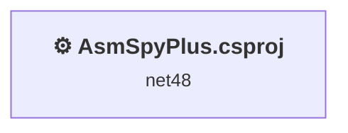
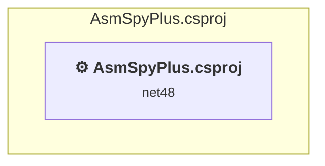

# Projects and dependencies analysis

This document provides a comprehensive overview of the projects and their dependencies in the context of upgrading to .NETCoreApp,Version=v10.0.

## Table of Contents

- [Executive Summary](#executive-Summary)
  - [Highlevel Metrics](#highlevel-metrics)
  - [Projects Compatibility](#projects-compatibility)
  - [Package Compatibility](#package-compatibility)
  - [API Compatibility](#api-compatibility)
  - [Binding Redirect Configuration](#binding-redirect-configuration)
- [Aggregate NuGet packages details](#aggregate-nuget-packages-details)
- [Top API Migration Challenges](#top-api-migration-challenges)
  - [Technologies and Features](#technologies-and-features)
  - [Most Frequent API Issues](#most-frequent-api-issues)
- [Projects Relationship Graph](#projects-relationship-graph)
- [Project Details](#project-details)

  - [AsmSpyPlus\AsmSpyPlus.csproj](#asmspyplusasmspypluscsproj)

## Executive Summary

### Highlevel Metrics

| Metric | Count | Status |
| :--- | :---: | :--- |
| Total Projects | 1 | All require upgrade |
| Total NuGet Packages | 0 | All compatible |
| Total Code Files | 21 |  |
| Total Code Files with Incidents | 10 |  |
| Total Lines of Code | 993 |  |
| Total Number of Issues | 98 |  |
| Estimated LOC to modify | 96+ | at least 9,7% of codebase |

### Projects Compatibility

| Project | Target Framework | Difficulty | Package Issues | API Issues | Binding Issues | Est. LOC Impact | Description |
| :--- | :---: | :---: | :---: | :---: | :---: | :---: | :--- |
| [AsmSpyPlus\AsmSpyPlus.csproj](#asmspyplusasmspypluscsproj) | net48 | 🟡 Medium | 0 | 96 | 0 | 96+ | ClassicWinForms, Sdk Style = False |

### Package Compatibility

| Status | Count | Percentage |
| :--- | :---: | :---: |
| ✅ Compatible | 0 | 0,0% |
| ⚠️ Incompatible | 0 | 0,0% |
| 🔄 Upgrade Recommended | 0 | 0,0% |
| ***Total NuGet Packages*** | ***0*** | ***100%*** |

### API Compatibility

| Category | Count | Impact |
| :--- | :---: | :--- |
| 🔴 Binary Incompatible | 87 | High - Require code changes |
| 🟡 Source Incompatible | 4 | Medium - Needs re-compilation and potential conflicting API error fixing |
| 🔵 Behavioral change | 5 | Low - Behavioral changes that may require testing at runtime |
| ✅ Compatible | 596 |  |
| ***Total APIs Analyzed*** | ***692*** |  |

## Aggregate NuGet packages details

| Package | Current Version | Suggested Version | Projects | Description |
| :--- | :---: | :---: | :--- | :--- |

## Top API Migration Challenges

### Technologies and Features

| Technology | Issues | Percentage | Migration Path |
| :--- | :---: | :---: | :--- |
| WPF (Windows Presentation Foundation) | 53 | 55,2% | WPF APIs for building Windows desktop applications with XAML-based UI that are available in .NET on Windows. WPF provides rich desktop UI capabilities with data binding and styling. Enable Windows Desktop support: Option 1 (Recommended): Target net9.0-windows; Option 2: Add <UseWindowsDesktop>true</UseWindowsDesktop>. |
| Windows Forms | 8 | 8,3% | Windows Forms APIs for building Windows desktop applications with traditional Forms-based UI that are available in .NET on Windows. Enable Windows Desktop support: Option 1 (Recommended): Target net9.0-windows; Option 2: Add <UseWindowsDesktop>true</UseWindowsDesktop>; Option 3 (Legacy): Use Microsoft.NET.Sdk.WindowsDesktop SDK. |
| Legacy Configuration System | 2 | 2,1% | Legacy XML-based configuration system (app.config/web.config) that has been replaced by a more flexible configuration model in .NET Core. The old system was rigid and XML-based. Migrate to Microsoft.Extensions.Configuration with JSON/environment variables; use System.Configuration.ConfigurationManager NuGet package as interim bridge if needed. |

### Most Frequent API Issues

| API | Count | Percentage | Category |
| :--- | :---: | :---: | :--- |
| T:System.Windows.Controls.DataGrid | 9 | 9,4% | Binary Incompatible |
| T:System.Windows.Input.Cursor | 4 | 4,2% | Binary Incompatible |
| P:System.Windows.Forms.FolderBrowserDialog.SelectedPath | 4 | 4,2% | Binary Incompatible |
| T:System.Windows.DependencyObject | 3 | 3,1% | Binary Incompatible |
| T:System.Windows.DependencyProperty | 3 | 3,1% | Binary Incompatible |
| T:System.Uri | 3 | 3,1% | Behavioral Change |
| T:System.Windows.Controls.Button | 3 | 3,1% | Binary Incompatible |
| T:System.Windows.Controls.DataGridAutoGeneratingColumnEventArgs | 2 | 2,1% | Binary Incompatible |
| P:System.Windows.Controls.DataGridAutoGeneratingColumnEventArgs.Cancel | 2 | 2,1% | Binary Incompatible |
| P:System.Windows.Controls.DataGridAutoGeneratingColumnEventArgs.PropertyDescriptor | 2 | 2,1% | Binary Incompatible |
| E:System.Windows.Controls.DataGrid.AutoGeneratingColumn | 2 | 2,1% | Binary Incompatible |
| T:System.Windows.Data.IValueConverter | 2 | 2,1% | Binary Incompatible |
| M:System.Uri.#ctor(System.String,System.UriKind) | 2 | 2,1% | Behavioral Change |
| T:System.Windows.Application | 2 | 2,1% | Binary Incompatible |
| T:System.Windows.RoutedEventHandler | 2 | 2,1% | Binary Incompatible |
| T:System.Windows.Input.Cursors | 2 | 2,1% | Binary Incompatible |
| T:System.Windows.Input.Mouse | 2 | 2,1% | Binary Incompatible |
| P:System.Windows.Input.Mouse.OverrideCursor | 2 | 2,1% | Binary Incompatible |
| T:System.Windows.Threading.DispatcherPriority | 2 | 2,1% | Binary Incompatible |
| M:System.Windows.Window.#ctor | 2 | 2,1% | Binary Incompatible |
| M:System.Windows.Markup.InternalTypeHelper.#ctor | 1 | 1,0% | Binary Incompatible |
| T:System.Windows.Markup.InternalTypeHelper | 1 | 1,0% | Binary Incompatible |
| T:System.Windows.DependencyPropertyChangedEventArgs | 1 | 1,0% | Binary Incompatible |
| P:System.Windows.DependencyPropertyChangedEventArgs.NewValue | 1 | 1,0% | Binary Incompatible |
| M:System.Windows.DependencyObject.SetValue(System.Windows.DependencyProperty,System.Object) | 1 | 1,0% | Binary Incompatible |
| M:System.Windows.DependencyObject.GetValue(System.Windows.DependencyProperty) | 1 | 1,0% | Binary Incompatible |
| M:System.Configuration.ApplicationSettingsBase.#ctor | 1 | 1,0% | Source Incompatible |
| T:System.Configuration.ApplicationSettingsBase | 1 | 1,0% | Source Incompatible |
| P:System.Reflection.AssemblyName.ProcessorArchitecture | 1 | 1,0% | Source Incompatible |
| M:System.Reflection.Assembly.ReflectionOnlyLoadFrom(System.String) | 1 | 1,0% | Source Incompatible |
| M:System.Windows.Application.Run | 1 | 1,0% | Binary Incompatible |
| P:System.Windows.Application.StartupUri | 1 | 1,0% | Binary Incompatible |
| M:System.Windows.Application.#ctor | 1 | 1,0% | Binary Incompatible |
| E:System.Windows.Controls.Primitives.ButtonBase.Click | 1 | 1,0% | Binary Incompatible |
| M:System.Windows.Application.LoadComponent(System.Object,System.Uri) | 1 | 1,0% | Binary Incompatible |
| P:System.Windows.FrameworkElement.DataContext | 1 | 1,0% | Binary Incompatible |
| T:System.Windows.RoutedEventArgs | 1 | 1,0% | Binary Incompatible |
| P:System.Windows.Input.Cursors.Arrow | 1 | 1,0% | Binary Incompatible |
| P:System.Windows.Controls.DataGridColumn.SortMemberPath | 1 | 1,0% | Binary Incompatible |
| T:System.ComponentModel.SortDescription | 1 | 1,0% | Binary Incompatible |
| M:System.ComponentModel.SortDescription.#ctor(System.String,System.ComponentModel.ListSortDirection) | 1 | 1,0% | Binary Incompatible |
| T:System.Windows.Controls.ItemCollection | 1 | 1,0% | Binary Incompatible |
| P:System.Windows.Controls.ItemsControl.Items | 1 | 1,0% | Binary Incompatible |
| T:System.ComponentModel.SortDescriptionCollection | 1 | 1,0% | Binary Incompatible |
| P:System.Windows.Controls.ItemCollection.SortDescriptions | 1 | 1,0% | Binary Incompatible |
| F:System.Windows.Threading.DispatcherPriority.ContextIdle | 1 | 1,0% | Binary Incompatible |
| P:System.Windows.Controls.DataGridColumn.SortDirection | 1 | 1,0% | Binary Incompatible |
| T:System.Windows.Threading.Dispatcher | 1 | 1,0% | Binary Incompatible |
| P:System.Windows.Threading.DispatcherObject.Dispatcher | 1 | 1,0% | Binary Incompatible |
| T:System.Windows.Threading.DispatcherOperation | 1 | 1,0% | Binary Incompatible |

## Projects Relationship Graph

Legend:
📦 SDK-style project
⚙️ Classic project

## Project Details

### AsmSpyPlus\AsmSpyPlus.csproj

#### Project Info

- **Current Target Framework:** net48
- **Proposed Target Framework:** net10.0-windows
- **SDK-style**: False
- **Project Kind:** ClassicWinForms
- **Dependencies**: 0
- **Dependants**: 0
- **Number of Files**: 22
- **Number of Files with Incidents**: 10
- **Lines of Code**: 993
- **Estimated LOC to modify**: 96+ (at least 9,7% of the project)

#### Dependency Graph

Legend:
📦 SDK-style project
⚙️ Classic project

### API Compatibility

| Category | Count | Impact |
| :--- | :---: | :--- |
| 🔴 Binary Incompatible | 87 | High - Require code changes |
| 🟡 Source Incompatible | 4 | Medium - Needs re-compilation and potential conflicting API error fixing |
| 🔵 Behavioral change | 5 | Low - Behavioral changes that may require testing at runtime |
| ✅ Compatible | 596 |  |
| ***Total APIs Analyzed*** | ***692*** |  |

#### Project Technologies and Features

| Technology | Issues | Percentage | Migration Path |
| :--- | :---: | :---: | :--- |
| Legacy Configuration System | 2 | 2,1% | Legacy XML-based configuration system (app.config/web.config) that has been replaced by a more flexible configuration model in .NET Core. The old system was rigid and XML-based. Migrate to Microsoft.Extensions.Configuration with JSON/environment variables; use System.Configuration.ConfigurationManager NuGet package as interim bridge if needed. |
| Windows Forms | 8 | 8,3% | Windows Forms APIs for building Windows desktop applications with traditional Forms-based UI that are available in .NET on Windows. Enable Windows Desktop support: Option 1 (Recommended): Target net9.0-windows; Option 2: Add <UseWindowsDesktop>true</UseWindowsDesktop>; Option 3 (Legacy): Use Microsoft.NET.Sdk.WindowsDesktop SDK. |
| WPF (Windows Presentation Foundation) | 53 | 55,2% | WPF APIs for building Windows desktop applications with XAML-based UI that are available in .NET on Windows. WPF provides rich desktop UI capabilities with data binding and styling. Enable Windows Desktop support: Option 1 (Recommended): Target net9.0-windows; Option 2: Add <UseWindowsDesktop>true</UseWindowsDesktop>. |

